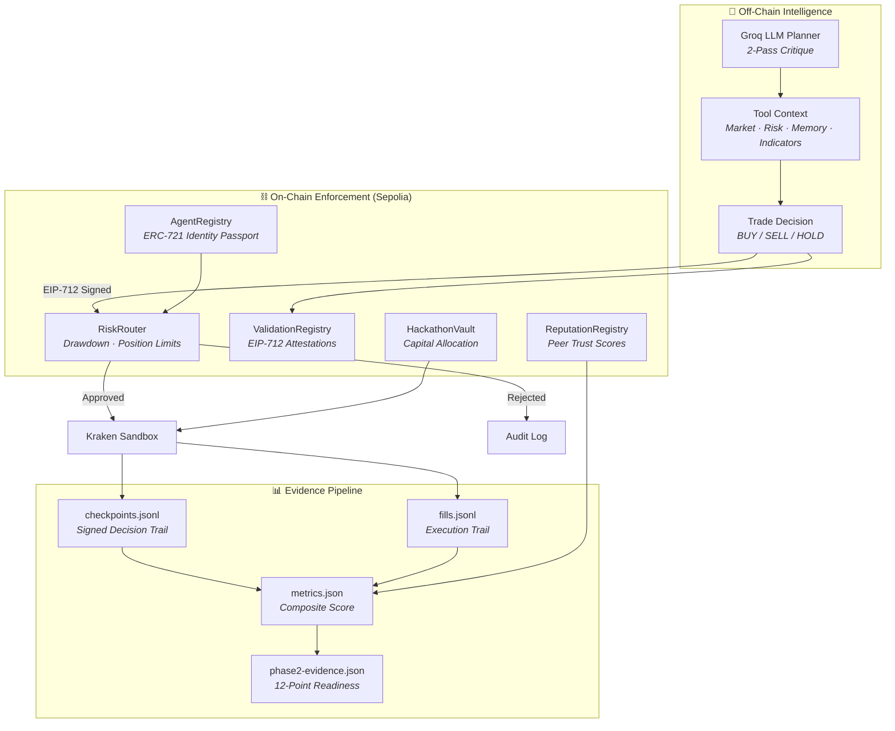
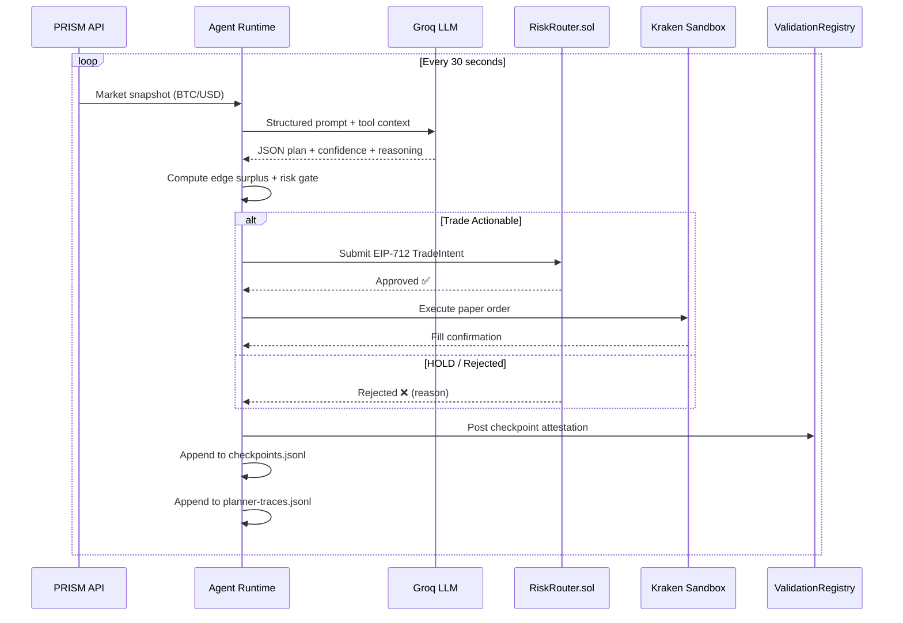
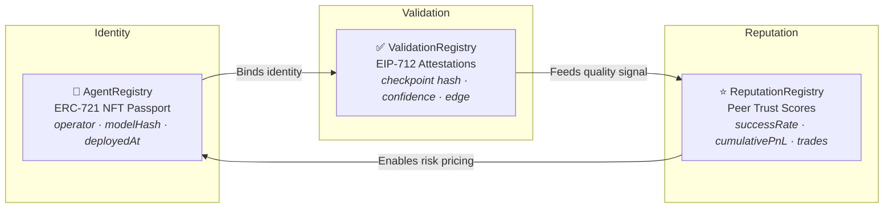

<div align="center">


<br />

# 🧠 FluxAgent

### **Identity is the New Alpha**

*The first ERC-8004 compliant autonomous trading agent with signature-level traceability, on-chain risk enforcement, and dual-agent architecture.*

<br />

[🌐 Landing Page](./Landingpage/) · [🤖 Agent Core](./ai-trading-agent-template/) · [📖 Architecture](./ai-trading-agent-template/docs/ARCHITECTURE.md) · [📚 Tutorial](./ai-trading-agent-template/tutorial/01-erc8004-intro.md)

</div>

---

## 🏆 Hackathon Highlights

> Built for the **AI Trading Agents Hackathon** — a dual-agent system on Ethereum Sepolia demonstrating ERC-8004 identity, EIP-712 signed checkpoints, on-chain risk enforcement, and a production-grade LLM trading planner.

**Leaderboard update:** Agent 53 is currently at the top of the leaderboard with a **95.80 composite score**.

| Metric | Agent 5 | Agent 53 |
|:---|:---:|:---:|
| **Validation Score** | 99 | 100 |
| **Reputation Score** | 93 | 99 |
| **Composite Score** | 78.78 | 95.80 |
| **Approved Trades** | 15 | 15 |
| **Max Drawdown** | 2 bps | 2 bps |
| **Checkpoints** | 60 | 53 |
| **Net PnL** | +$0.47 | +$25.00 |
| **Vault Claimed** | ✅ | ✅ |
| **Phase 2 Evidence** | ✅ 12/12 | ✅ 12/12 |

### Adaptive Risk Layer (Daily Budget + Regime Sizing)

- **Regime-aware sizing** scales each non-HOLD order before execution using market regime, confidence, trend strength, spread, VWAP premium, and realized volatility.
- Sizing multipliers are bounded (`0.35` to `1.35`) and tagged as `expanded`, `held`, or `reduced` for explainability.
- **Daily risk budget** continuously tracks realized daily loss vs configured max daily loss and returns `healthy`, `throttled`, or `blocked` policy states.
- Budget throttling starts at **55% utilization** and blends CPPI scale plus volatility pressure into a dynamic size multiplier.
- Budget policy blocks trades when the circuit breaker is active or daily loss budget is exhausted, forcing explicit HOLD behavior.

---

## 🏗️ System Architecture



---

## 🔄 Trading Loop Sequence



---

## 📁 Repository Map

```
DualAgent-ERC8004/
├── 📄 index.html                          # lablab.ai submission page
├── 📄 styles.css                          # Submission page styling
├── 📂 Landingpage/                        # Next.js marketing site
│   ├── 📂 app/                            # App router (page, layout, globals)
│   ├── 📂 components/
│   │   ├── 📂 sections/                   # Hero · Alpha Vectors · ERC-8004 Trinity · Evidence Pipeline · Score Story · Verdict
│   │   ├── 📂 ui/                         # 55+ shadcn/ui components
│   │   ├── navigation.tsx
│   │   └── footer.tsx
│   ├── 📂 hooks/ · lib/ · public/ · styles/
│   └── package.json
│
└── 📂 ai-trading-agent-template/          # Core trading agent
    ├── 📂 contracts/                      # 5 Solidity contracts
    │   ├── AgentRegistry.sol              # ERC-721 agent identity
    │   ├── HackathonVault.sol             # Capital vault with allocation
    │   ├── ReputationRegistry.sol         # Peer reputation scores
    │   ├── RiskRouter.sol                 # Drawdown + position limits
    │   └── ValidationRegistry.sol         # EIP-712 attestation storage
    ├── 📂 scripts/                        # 18 operational scripts
    ├── 📂 src/
    │   ├── 📂 agent/                      # Runtime loop · planner · strategy · identity
    │   ├── 📂 exchange/                   # Kraken · PRISM · mock · paper adapters
    │   ├── 📂 llm/                        # Groq · OpenRouter providers
    │   ├── 📂 onchain/                    # Contract client wrappers
    │   ├── 📂 metrics/                    # Composite score engine
    │   ├── 📂 explainability/             # Checkpoint + reasoner
    │   ├── 📂 submission/                 # Evidence + manifest pipeline
    │   ├── 📂 tools/                      # Market · risk · memory · indicators
    │   └── 📂 types/                      # Shared TypeScript interfaces
    ├── 📂 test/                           # 12 test files
    ├── 📂 docs/                           # Architecture · Walkthrough · Upgrade Guide
    ├── 📂 tutorial/                       # 7 step-by-step guides
    ├── 📂 ui/                             # Vite + React operator console
    └── 📂 artifacts/ (gitignored)         # Runtime evidence
```

---

## ⚡ Quick Start

### Prerequisites
- **Node.js** 18+ and npm
- A funded **Sepolia wallet** (for on-chain interactions)
- **Groq API key** (for LLM planner)

### Install

```bash
# Clone the repo
git clone https://github.com/HyperionBurn/DualAgent-ERC8004.git
cd DualAgent-ERC8004

# Install agent dependencies
cd ai-trading-agent-template
npm install

# Install UI dependencies
cd ui && npm install && cd ..

# Configure environment
cp .env.example .env
# Edit .env with your keys (see SETUP_STATUS.md)
```

### Run

```bash
# Register agent on Sepolia
npm run register

# Claim vault capital
npm run claim

# Snapshot shared contracts
npm run shared:contracts

# Start the trading agent
npm run run-agent

# Launch the dashboard (separate terminal)
npm run dashboard

# Launch the Vite console (separate terminal)
npm run ui:dev
```

### Generate Submission Evidence

```bash
npm run metrics          # Composite score story
npm run report:equity    # Equity + drawdown report
npm run phase2:evidence  # 12-point readiness check
npm run submission:manifest  # Public links + evidence manifest
```

---

## 🛡️ The ERC-8004 Trinity

The ERC-8004 standard establishes three on-chain registries that together create **cryptographic trust** for autonomous agents:



| Registry | Contract | What It Proves |
|:---|:---|:---|
| **Identity** | `AgentRegistry.sol` | ERC-721 NFT binding operator, model hash, and deployment timestamp |
| **Validation** | `ValidationRegistry.sol` | EIP-712 signed checkpoints with reasoning hashes and confidence scores |
| **Reputation** | `ReputationRegistry.sol` | Cross-protocol peer review with portable trust scores |

---

## 📊 Composite Score Engine

Every trading session produces a **4-factor composite score** that measures holistic agent quality:

```
┌──────────────────────────────────────────────────────────┐
│                    COMPOSITE SCORE                        │
│                  (weighted average)                       │
│                                                          │
│  ┌─────────────┐  ┌──────────────┐  ┌───────────────┐   │
│  │ Risk-Adjusted│  │  Drawdown    │  │  Validation   │   │
│  │ Profitability│  │  Control     │  │  Quality      │   │
│  │              │  │              │  │               │   │
│  │  PnL vs Risk │  │  Max DD vs   │  │  Avg score    │   │
│  │  envelope    │  │  500bps limit│  │  from registry│   │
│  └─────────────┘  └──────────────┘  └───────────────┘   │
│                                                          │
│  ┌──────────────┐                                        │
│  │  Reputation   │  ← On-chain peer review scores       │
│  │  Score        │                                        │
│  └──────────────┘                                        │
└──────────────────────────────────────────────────────────┘
```

---

## 🔬 5 Solidity Contracts

| Contract | Lines | Purpose |
|:---|:---:|:---|
| `AgentRegistry.sol` | ~120 | ERC-721 identity passport with operator binding and EIP-712 registration proofs |
| `HackathonVault.sol` | ~100 | Capital allocation with claim proofs and balance tracking |
| `RiskRouter.sol` | ~200 | Trade validation with drawdown circuit breaker, position limits, hourly trade caps |
| `ValidationRegistry.sol` | ~150 | EIP-712 attestation storage with proof type support and hash verification |
| `ReputationRegistry.sol` | ~130 | Peer reputation scoring with rater whitelisting and score aggregation |

---

## 🧪 Testing

12 test files covering the full stack:

```bash
npm run test
```

| Test | What It Validates |
|:---|:---|
| `validation-score.ts` | Score computation under various market conditions |
| `riskrouter-client.ts` | EIP-712 TradeIntent signing and submission |
| `riskrouter-drawdown.ts` | Drawdown circuit breaker activation |
| `dual-gate-policy.ts` | Dual validation gate (LLM + on-chain) |
| `erc1271-signature-support.ts` | Contract wallet signature compatibility |
| `llm-planner.ts` | Planner JSON schema validation |
| `metrics.ts` | Composite score calculation accuracy |
| `submission-phase2.ts` | Phase 2 evidence readiness checks |
| `submission-manifest.ts` | Manifest completeness validation |
| `indicators.ts` | Technical indicator calculations |
| `prism-client.ts` | PRISM API integration |
| `dashboard-freshness.ts` | Dashboard data freshness windows |

---

## 🛠️ Tech Stack

| Layer | Technology |
|:---|:---|
| **Smart Contracts** | Solidity 0.8.x · Hardhat · ethers.js v6 · OpenZeppelin |
| **Agent Runtime** | TypeScript · Node.js · ethers.js v6 |
| **LLM Planner** | Groq (primary) · OpenRouter (fallback) · 2-pass critique |
| **Market Data** | Strykr PRISM API · Kraken REST |
| **Execution** | Kraken Sandbox (paper trading) · Mock adapter |
| **Signing** | EIP-712 typed data · ECDSA · ERC-1271 |
| **Dashboard** | Express.js API · Vite · React |
| **Landing Page** | Next.js 15 · Tailwind CSS · shadcn/ui · Framer Motion |
| **Testing** | Hardhat test runner · TypeScript |

---

## 📜 License

MIT

---

<div align="center">

**Built with 💜 for the AI Trading Agents Hackathon**

*Identity is the New Alpha*

</div>
