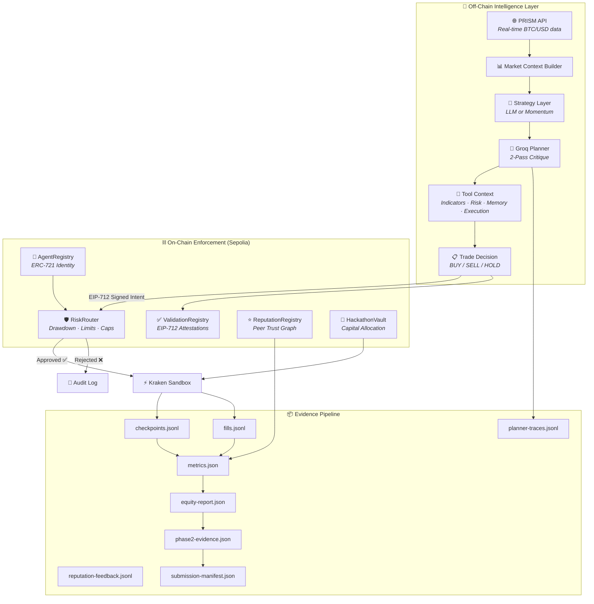
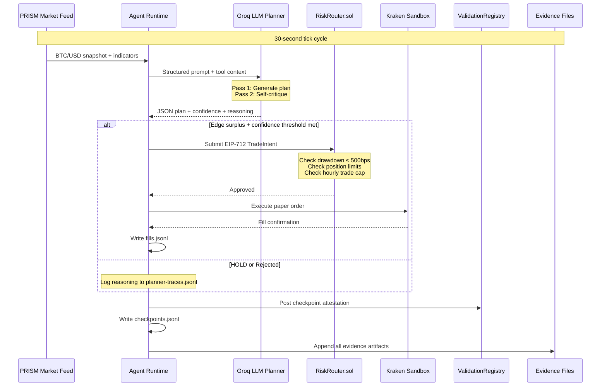
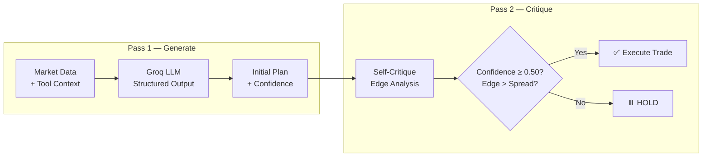

<div align="center">


<br />

# 🧠 FluxAgent — Trading Agent Core

### **Autonomous Trading with Cryptographic Proof**

*Every decision is signed. Every trade is attested. Every risk is enforced on-chain.*

<br />

[📖 Architecture Doc](./docs/ARCHITECTURE.md) · [🚀 Detailed Walkthrough](./docs/DETAILED_WALKTHROUGH.md) · [📚 Tutorial](./tutorial/01-erc8004-intro.md) · [⬆️ Parent Repo](../)

</div>

---

## 🎯 Why This Hits Different

FluxAgent isn't just another trading bot. It's a **verifiable decision engine** — every action the agent takes is cryptographically bound to its on-chain identity, enforced by immutable smart contracts, and replayable through a complete audit trail.

| Feature | What It Means |
|:---|:---|
| 🔐 **ERC-8004 Identity** | On-chain agent passport via ERC-721 NFT — operator, model hash, and deployment timestamp are immutable |
| ✍️ **EIP-712 Checkpoints** | Every decision is typed-data signed with the agent's key — reasoning, confidence, edge, and market state are all committed |
| 🛡️ **On-Chain Risk Gates** | `RiskRouter.sol` enforces drawdown limits, position caps, and hourly trade limits — the LLM *proposes*, the chain *disposes* |
| 🎚️ **Regime-Aware Sizing** | Position size is adjusted per tick from regime label/confidence, trend strength, spread, VWAP premium, and realized volatility (bounded multiplier `0.35` to `1.35`) |
| 🧾 **Daily Risk Budget** | Runtime budget policy tracks daily loss utilization and shifts between `healthy`, `throttled`, and `blocked`, forcing HOLD when budget or breaker constraints are hit |
| 🧠 **2-Pass LLM Critique** | Groq-accelerated planner generates a plan, then self-critiques it before execution — catching hallucinated trades |
| ⭐ **Reputation Loop** | Cross-protocol peer review accumulates portable trust scores via `ReputationRegistry.sol` |
| 📊 **Composite Score Engine** | 4-factor score: risk-adjusted profitability + drawdown control + validation quality + reputation |
| 🔄 **Full Audit Trail** | Checkpoints, fills, planner traces, and reputation feedback — every artifact is human-readable and machine-verifiable |

---

## 🏗️ Architecture



---

## 🔄 Runtime Loop — Every Tick



---

## 📊 Live Performance

Dual-agent deployment on Sepolia testnet — both agents passing all 12 phase-2 readiness checks:

**Leaderboard update:** Agent 53 is currently at the top with a **95.80 composite score**.

| Metric | 🟢 Agent 5 | 🔵 Agent 53 |
|:---|:---:|:---:|
| **Validation Score** | `99.00` | `100.00` |
| **Reputation Score** | `93.00` | `99.00` |
| **Composite Score** | `78.78` | `95.80` |
| **Approved Trades** | 15 | 15 |
| **Checkpoints** | 60 | 53 |
| **Max Drawdown** | 2 bps | 2 bps |
| **Net PnL** | +$0.47 | +$25.00 |
| **Current Equity** | $10,000.47 | $10,025.00 |
| **Vault Claimed** | ✅ | ✅ |
| **Phase 2 Checks** | 12/12 ✅ | 12/12 ✅ |

### Adaptive Risk Controls (New)

- **Regime-aware sizing pipeline:** every actionable decision is passed through a sizing policy driven by regime label, regime confidence, trend strength, spread, VWAP premium, and realized volatility.
- **Sizing outcomes:** policy outputs `expanded`, `held`, or `reduced`, then scales order notional while respecting planner caps and preserving explainability in decision context.
- **Daily risk budget policy:** runtime loss utilization is measured against `BREAKER_MAX_DAILY_LOSS_USD` and returns `healthy`, `throttled`, or `blocked`.
- **Throttle behavior:** throttling begins at **55% budget utilization**, with multiplier adjustments blended from CPPI scale and volatility throttle state.
- **Hard stops:** breaker-active or exhausted-budget states force HOLD and annotate the reason in checkpoints/evidence.

---

## ⚡ Quick Start

### 1. Install

```bash
npm install
npm --prefix ui install
cp .env.example .env
# Edit .env with your Sepolia RPC, private keys, and API keys
```

### 2. Register Agent on Sepolia

```bash
# Set AGENT_ID, SEPOLIA_RPC_URL, PRIVATE_KEY in .env
npm run register        # Mint ERC-721 agent passport
npm run claim           # Claim vault capital allocation
npm run shared:contracts  # Snapshot shared contract state
```

### 3. Run the Agent

```bash
npm run run-agent       # Start the trading loop (30s tick)
npm run dashboard       # Launch Express API + React UI (port 3000)
npm run ui:dev          # Launch Vite dev console (port 5173)
```

### 4. Generate Evidence Package

```bash
npm run metrics                # Composite score story
npm run report:equity          # Equity + drawdown report
npm run phase2:evidence        # 12-point readiness check
npm run submission:manifest    # Public links + evidence manifest
```

> **Two-pass manifest flow**: Run `submission:manifest` → `phase2:evidence` → `submission:manifest` to lock the final package.

### 5. Smoke Test

```bash
npm run llm:smoke       # Test planner without trading
npm run test            # Run full test suite (12 tests)
```

---

## 🎛️ Command Center

| Goal | Command |
|:---|:---|
| ⚙️ Compile contracts | `npm run compile` |
| 🧪 Run full tests | `npm run test` |
| 🪪 Register agent on Sepolia | `npm run register` |
| 🏦 Claim sandbox capital | `npm run claim` |
| 📸 Snapshot shared contracts | `npm run shared:contracts` |
| 🚀 Run trading agent | `npm run run-agent` |
| 📊 Launch dashboard | `npm run dashboard` |
| 🖥️ Launch Vite console | `npm run ui:dev` |
| 📈 Export score story | `npm run metrics` |
| 🔄 Replay planner traces | `npm run replay` |
| 💨 Planner smoke test | `npm run llm:smoke` |
| 🎯 Matrix evaluation | `npm run evaluate` |
| 💰 Equity + drawdown report | `npm run report:equity` |
| 📋 Build submission manifest | `npm run submission:manifest` |
| ✅ Phase readiness check | `npm run phase2:evidence` |
| ⭐ Seed reputation entries | `npm run seed:reputation` |

---

## 🛡️ Solidity Contracts

| Contract | Purpose | Key Features |
|:---|:---|:---|
| `AgentRegistry.sol` | ERC-721 agent identity | Operator binding, model hash commitment, EIP-712 registration proofs |
| `HackathonVault.sol` | Capital allocation | Per-agent balances, claim proofs, deposit/withdraw tracking |
| `RiskRouter.sol` | Trade validation | Drawdown circuit breaker, position limits, hourly trade caps, intent hashing |
| `ValidationRegistry.sol` | Attestation storage | EIP-712 proof types, checkpoint hash verification, coverage tracking |
| `ReputationRegistry.sol` | Peer trust scores | Rater management, score aggregation, cross-protocol portability |

---

## 🧠 LLM Planner — 2-Pass Critique Architecture

The planner doesn't just generate a trade — it **critiques its own output** before the agent acts:



**Supported Providers:**
- **Groq** (primary) — `openai/gpt-oss-20b`, `llama-3.3-70b-versatile`, `llama-3.1-8b-instant`
- **OpenRouter** (fallback) — configurable models

**Edge Formula:**

$$\text{estimatedEdge} = (\text{confidence} - 0.5) \times 250 + \text{vwapBias} - \text{spreadBps}$$

---

## 📦 Evidence Artifacts

Every trading session produces a complete, verifiable evidence package:

```
┌─────────────────────────────────────────────────────────────────┐
│                    EVIDENCE PIPELINE                             │
│                                                                 │
│  ┌─────────────────┐    ┌──────────────────┐                   │
│  │ checkpoints.jsonl │───▶│ metrics.json     │                  │
│  │ (signed decisions)│    │ (composite score)│                  │
│  └─────────────────┘    └────────┬─────────┘                   │
│                                   │                              │
│  ┌─────────────────┐             │    ┌──────────────────┐      │
│  │ fills.jsonl      │────────────┼───▶│ equity-report.json│    │
│  │ (execution trail) │            │    │ (drawdown + PnL)  │    │
│  └─────────────────┘             │    └──────────────────┘      │
│                                   │                              │
│  ┌─────────────────┐    ┌────────▼─────────┐                   │
│  │ planner-traces   │───▶│ phase2-evidence   │                  │
│  │ .jsonl (reasoning)│   │ .json (12 checks) │                  │
│  └─────────────────┘    └────────┬─────────┘                   │
│                                   │                              │
│  ┌─────────────────┐    ┌────────▼─────────┐                   │
│  │ shared-contracts │───▶│ submission        │                  │
│  │ .json (on-chain) │    │ -manifest.json    │                  │
│  └─────────────────┘    └──────────────────┘                    │
│                                                                 │
│  ┌─────────────────┐    ┌──────────────────┐                    │
│  │ reputation       │───▶│ capital-proof     │                   │
│  │ -feedback.jsonl  │    │ .json (vault)     │                   │
│  └─────────────────┘    └──────────────────┘                    │
└─────────────────────────────────────────────────────────────────┘
```

---

## 🧪 Test Suite

12 tests covering the full trading stack:

```bash
npm run test
```

| Test File | What It Validates |
|:---|:---|
| `validation-score.ts` | Score computation under various conditions |
| `riskrouter-client.ts` | EIP-712 TradeIntent signing and submission |
| `riskrouter-drawdown.ts` | Circuit breaker activation thresholds |
| `dual-gate-policy.ts` | LLM + on-chain dual validation gate |
| `erc1271-signature-support.ts` | Contract wallet signature compatibility |
| `llm-planner.ts` | Planner JSON schema and output validation |
| `metrics.ts` | Composite score calculation accuracy |
| `submission-phase2.ts` | Phase 2 readiness checks (12 gates) |
| `submission-manifest.ts` | Manifest completeness validation |
| `indicators.ts` | Technical indicator calculations |
| `prism-client.ts` | PRISM API integration and caching |
| `dashboard-freshness.ts` | Dashboard data freshness windows |

---

## 📂 Project Structure

```
ai-trading-agent-template/
├── 📂 contracts/              # 5 Solidity contracts
│   ├── AgentRegistry.sol      # ERC-721 identity passport
│   ├── HackathonVault.sol     # Capital allocation vault
│   ├── ReputationRegistry.sol # Peer reputation system
│   ├── RiskRouter.sol         # Trade validation + risk gates
│   ├── ValidationRegistry.sol # EIP-712 attestation storage
│   └── mocks/                 # Test mocks (ERC-1271 wallet)
│
├── 📂 scripts/                # 18 operational scripts
│   ├── run-agent.ts           # 🚀 Main trading loop entry
│   ├── dashboard.ts           # 📊 Express API + React UI
│   ├── metrics.ts             # 📈 Score story generator
│   ├── phase2-evidence.ts     # ✅ 12-point readiness check
│   ├── report-equity.ts       # 💰 Equity + drawdown report
│   ├── submission-manifest.ts # 📋 Evidence manifest builder
│   ├── seed-reputation.ts     # ⭐ Reputation seeder
│   ├── register-agent.ts      # 🪪 Agent registration
│   ├── claim.ts               # 🏦 Vault capital claim
│   ├── deploy.ts              # ⚙️ Contract deployment
│   ├── deploy-validation-registry.ts
│   ├── shared-contracts.ts    # 📸 Contract snapshot
│   ├── evaluate.ts            # 🎯 Matrix run evaluator
│   ├── replay.ts              # 🔄 Trace replay
│   ├── llm-smoke.ts           # 💨 Planner smoke test
│   ├── matrix-runner.ts       # 🔢 Parameter sweep
│   ├── preflight.ts           # ✔️ Pre-flight checks
│   ├── allocate-sandbox-capital.ts
│   └── shared/single-instance.ts  # Process lock
│
├── 📂 src/
│   ├── 📂 agent/              # Core runtime
│   │   ├── index.ts           # Main agent loop (tick cycle)
│   │   ├── planner.ts         # LLM planner integration
│   │   ├── strategy.ts        # Strategy selection (LLM/momentum)
│   │   ├── identity.ts        # Agent identity binding
│   │   ├── adaptive-policy.ts # Dynamic parameter adjustment
│   │   ├── orchestrator.ts    # Strategy orchestration
│   │   └── validation-score.ts# Score computation
│   │
│   ├── 📂 exchange/           # Market adapters
│   │   ├── kraken.ts          # Kraken CLI execution
│   │   ├── prism.ts           # PRISM API market data
│   │   ├── live.ts            # Live Kraken adapter
│   │   ├── paper.ts           # Paper trading broker
│   │   └── mock.ts            # Synthetic market generator
│   │
│   ├── 📂 llm/                # LLM providers
│   │   ├── groq.ts            # Groq API client
│   │   ├── openrouter.ts      # OpenRouter client
│   │   ├── provider.ts        # Provider selection
│   │   └── schemas.ts         # Response schemas + normalization
│   │
│   ├── 📂 onchain/            # Contract clients
│   │   ├── riskRouter.ts      # RiskRouter wrapper
│   │   ├── validationRegistry.ts # Validation client
│   │   ├── reputationRegistry.ts # Reputation client
│   │   └── vault.ts           # Vault client
│   │
│   ├── 📂 metrics/            # Score engine
│   │   └── index.ts           # 4-factor composite score
│   │
│   ├── 📂 explainability/     # Decision transparency
│   │   ├── checkpoint.ts      # EIP-712 checkpoint generation
│   │   └── reasoner.ts        # Human-readable explanations
│   │
│   ├── 📂 submission/         # Evidence pipeline
│   │   ├── artifacts.ts       # Artifact management
│   │   ├── equity.ts          # Equity computation
│   │   ├── manifest.ts        # Manifest builder
│   │   ├── phase2.ts          # Phase 2 checks
│   │   ├── public-links.ts    # Public URL management
│   │   └── shared.ts          # Shared contract helpers
│   │
│   ├── 📂 tools/              # Planner tool context
│   │   ├── market.ts          # Market data tools
│   │   ├── risk.ts            # Risk analysis tools
│   │   ├── indicators.ts      # Technical indicators
│   │   ├── memory.ts          # Session memory
│   │   ├── execution.ts       # Execution state
│   │   ├── checkpoints.ts     # Checkpoint history
│   │   └── index.ts           # Tool aggregator
│   │
│   ├── 📂 types/              # TypeScript interfaces
│   ├── freshness.ts           # Data freshness tracking
│   └── runtime/profile.ts     # Runtime profiling
│
├── 📂 test/                   # 12 test files
├── 📂 docs/                   # Architecture + walkthrough docs
├── 📂 tutorial/               # 7 step-by-step guides
├── 📂 ui/                     # Vite + React operator console
│   ├── src/
│   │   ├── App.tsx
│   │   ├── components/        # CheckpointFeed · EquityChart · MarketContext · MetricCard · Sparkline · StatusChips · TraceFeed · ValidationProofs
│   │   └── lib/api.ts
│   └── vite.config.ts
│
├── .env.example               # Template configuration
├── hardhat.config.ts          # Hardhat setup
├── tsconfig.json              # TypeScript config
├── package.json               # Dependencies
├── README.md                  # This file
├── SETUP_STATUS.md            # Setup runbook
└── .gitignore                 # Excludes secrets + artifacts
```

---

## 🔐 Environment Configuration

Copy `.env.example` and fill in your keys:

```env
# ── Required ────────────────────────────────────────────────
SEPOLIA_RPC_URL=https://eth-sepolia.g.alchemy.com/v2/YOUR_KEY
PRIVATE_KEY=0xYOUR_OPERATOR_PRIVATE_KEY
AGENT_ID=5
CHAIN_ID=11155111

# ── Execution ───────────────────────────────────────────────
EXECUTION_MODE=kraken          # kraken | mock | paper
KRAKEN_SANDBOX=true            # true = paper trading
MARKET_DATA_MODE=prism         # prism | kraken | mock
TRADING_STRATEGY=llm           # llm | momentum
LLM_PROVIDER=groq              # groq | openrouter

# ── Shared Sepolia Contracts ────────────────────────────────
AGENT_REGISTRY_ADDRESS=0x97b07dDc405B0c28B17559aFFE63BdB3632d0ca3
HACKATHON_VAULT_ADDRESS=0x0E7CD8ef9743FEcf94f9103033a044caBD45fC90
RISK_ROUTER_ADDRESS=0xd6A6952545FF6E6E6681c2d15C59f9EB8F40FdBC
REPUTATION_REGISTRY_ADDRESS=0x423a9904e39537a9997fbaF0f220d79D7d545763
VALIDATION_REGISTRY_ADDRESS=0x6e0A7C2c158fa535083FDeFA1839273fAc36C9BE

# ── Optional Reputation Loop ────────────────────────────────
ENABLE_REPUTATION_LOOP=true
SUBMISSION_STRICT=true
```

---

## 📝 Key Design Decisions

| Decision | Rationale |
|:---|:---|
| **Shared Sepolia contracts** | Judges verify against a single canonical deployment — no local Hardhat forks |
| **Single-agent artifact enforcement** | Mixed `agentId` in checkpoints/fills is a hard failure in phase-2 evidence |
| **Read-only equity report** | `report-equity` computes locally without mutating on-chain state |
| **One-shot hard gates** | Checkpoints 30–60, fills 5–15, PnL > 0, drawdown ≤ 500bps — prevents gaming |
| **2-pass manifest flow** | First pass creates manifest shell, second pass locks after evidence is generated |
| **EIP-712 typed data** | Standard Ethereum signing — compatible with EOA + ERC-1271 contract wallets |

---

<div align="center">

**Built with 💜 for the AI Trading Agents Hackathon**

*Identity is the New Alpha*

</div>
  submission-manifest.ts
  phase2-evidence.ts

src/
  agent/
  exchange/
  explainability/
  metrics/
  onchain/
  types/
```

## Contributor

This project is 100% built and maintained by **HyperionBurn**.

- Sole contributor: **HyperionBurn**
- Contributor share: **100%**

## Frontend Console

The recommended operator console lives in [ui/](ui/) and is powered by Vite + React.

- `npm run ui:dev` starts the live trading console.
- `npm run ui:build` builds a production bundle.
- The UI consumes `/api/status`, `/api/price`, `/api/checkpoints`, `/api/traces`, and `/api/metrics` from the backend.

## License

MIT
