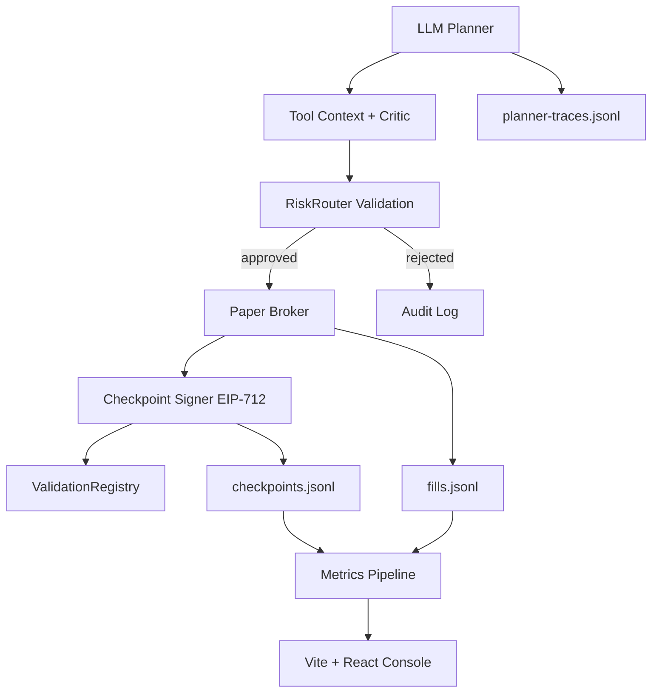
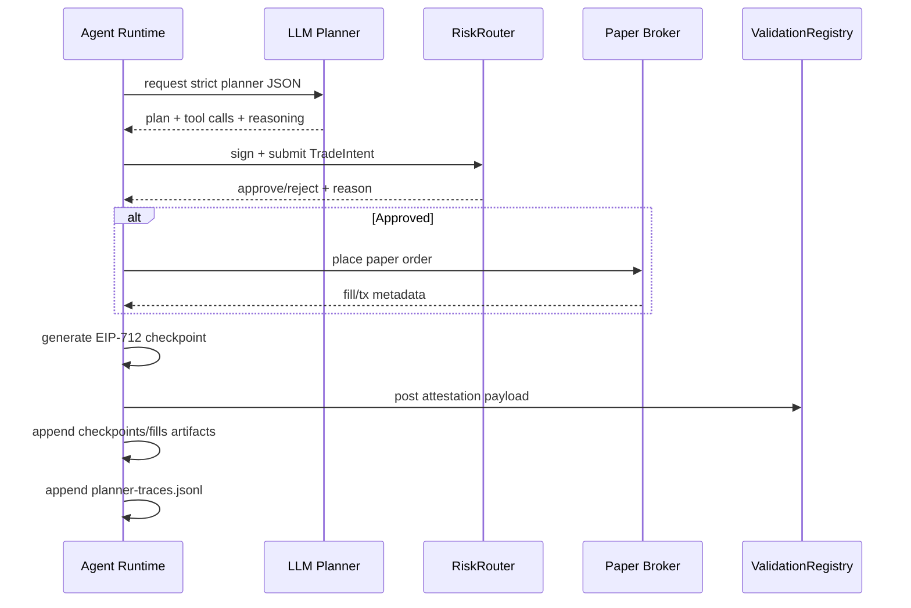

# GLM Trading Agent

<p align="left">
  
  
  
  
  
</p>

An autonomous trading system with on-chain identity, planner-executor reasoning, on-chain risk gates, signed checkpoints, replayable traces, and submission-ready evidence artifacts.

## Why This Hits Different

- On-chain identity via ERC-8004-style `AgentRegistry` flows
- Signature compatibility for EOA and contract-wallet paths (ERC-1271)
- Shared-router guardrails plus locally computed drawdown evidence
- EIP-712 signed checkpoints for decision transparency
- Groq planner support with safe env-only keys and a fallback OpenRouter path
- Live market data with paper-only execution and trace logging
- Vite + React console for live status, checkpoints, and planner traces
- Score-story exports (`metrics.json`) and readiness outputs (`phase2-evidence.json`)

## Visual Architecture



## Runtime Loop



## Quick Start

### 1) Install

```bash
npm install
npm --prefix ui install
cp .env.example .env
```

### 2) Use the shared Sepolia submission profile

- Shared Sepolia is the canonical submission flow.
- Final demo profile: `AGENT_ID=5`, `EXECUTION_MODE=kraken`, `KRAKEN_SANDBOX=true`, `MARKET_DATA_MODE=prism`, `TRADING_STRATEGY=llm`, `LLM_PROVIDER=groq`, `PLANNER_MAX_TRADE_USD=50`.
- Turn on `SUBMISSION_STRICT=true` once you are generating the final judge-facing artifact set.
- Local Hardhat deployment is now dev-only and should not be used as submission evidence.

### 3) Register and fund the shared agent

```bash
npm run register
npm run claim
npm run shared:contracts
```

Set `SEPOLIA_RPC_URL`, `PRIVATE_KEY`, `AGENT_WALLET_PRIVATE_KEY`, and `AGENT_ID=5` before running the shared-contract commands.

### 4) Run the agent on a clean submission session

```bash
# archive old mixed-agent artifacts before the clean run
npm run run-agent
npm run dashboard
npm run ui:dev
```

If you want a planner-only smoke test, run:

```bash
npm run llm:smoke
```

### 5) Generate the proof package

```bash
npm run seed:reputation
npm run metrics
npm run replay
npm run evaluate
npm run report:equity
npm run submission:manifest:allow-missing
npm run phase2:evidence
npm run submission:manifest
npm run phase2:evidence
```

The two-pass manifest flow is intentional: the first pass writes the manifest before `phase2-evidence.json` exists, and the second pass locks the final package once the evidence file is present.

`npm run evaluate` now snapshots each run under `artifacts/runs/<RUN_LABEL>/run-summary.json`, ranks all saved runs with one-shot hard gates, and writes `evaluation-results.json` plus `winner-run.json` when a gate-passing winner exists.

Set `LLM_PROVIDER=groq` in `.env` when you want the agent to use the Groq planner. The default Groq model is `openai/gpt-oss-20b`, with `llama-3.3-70b-versatile` and `llama-3.1-8b-instant` as configured fallbacks.

## Command Center

| Goal | Command |
|---|---|
| Compile contracts | `npm run compile` |
| Run full tests | `npm run test` |
| Register shared Sepolia agent | `npm run register` |
| Claim shared sandbox capital | `npm run claim` |
| Snapshot shared contracts | `npm run shared:contracts` |
| Run agent loop | `npm run run-agent` |
| Launch dashboard | `npm run dashboard` |
| Launch Vite console | `npm run ui:dev` |
| Export score story | `npm run metrics` |
| Replay planner traces | `npm run replay` |
| Planner smoke test | `npm run llm:smoke` |
| One-shot matrix evaluation + winner selection | `npm run evaluate` |
| Generate equity + drawdown evidence | `npm run report:equity` |
| Build submission manifest | `npm run submission:manifest` |
| Generate phase readiness | `npm run phase2:evidence` |

## Key Artifacts

- `shared-contracts.json`: shared Sepolia contract snapshot with live bytecode checks
- `capital-proof.json`: shared vault funding proof from the claim flow
- `registration-proof.json`: typed-signature registration proof
- `checkpoints.jsonl`: signed decision trail
- `fills.jsonl`: execution trail
- `metrics.json`: composite score story (risk-adjusted profitability, drawdown control, validation quality, objective reputation)
- `equity-report.json`: local equity and drawdown evidence plus shared router guardrails
- `planner-traces.jsonl`: model calls, tool results, and fallback decisions
- `submission-manifest.json`: required public links + evidence pointers
- `phase2-evidence.json`: deterministic readiness checks, router enforcement proof, and fail reasons
- `evaluation-results.json`: matrix run ranking with one-shot gate results
- `winner-run.json`: selected winning run snapshot when all hard gates pass

## Submission Notes

- Submission artifacts must belong to one agent only. If `AGENT_ID=5`, mixed `agentId:"0"` checkpoints, fills, traces, or reputation evidence are treated as failures.
- Shared Sepolia is the source of truth. `deployed.json` and local Hardhat deploys are useful for development, not for the final proof package.
- `report:equity` is read-only. It computes drawdown from local fills and checkpoints and pairs that with live shared-router guardrail reads; it does not submit on-chain drawdown state.
- One-shot gates enforce final candidate quality: checkpoints 30-60, fills 5-15, net PnL > 0, max drawdown <= 500 bps, and reputation evidence depth >= 3 from `reputation-registry`.

## Optional Reputation Loop

Enable this when you want automatic objective feedback writes:

```env
```

When active, runtime feedback is written to `reputation-feedback.jsonl` and included in `metrics.json` as an objective reputation input.

For final submission readiness, keep this loop enabled and confirm `npm run phase2:evidence` passes with non-empty reputation evidence.

## Project Map

```text
contracts/
  AgentRegistry.sol
  HackathonVault.sol
  ReputationRegistry.sol
  RiskRouter.sol
  ValidationRegistry.sol

scripts/
  deploy.ts
  register-agent.ts
  run-agent.ts
  dashboard.ts
  metrics.ts
  report-equity.ts
  submission-manifest.ts
  phase2-evidence.ts

src/
  agent/
  exchange/
  explainability/
  metrics/
  onchain/
  types/
```

## Contributor

This project is 100% built and maintained by **HyperionBurn**.

- Sole contributor: **HyperionBurn**
- Contributor share: **100%**

## Frontend Console

The recommended operator console lives in [ui/](ui/) and is powered by Vite + React.

- `npm run ui:dev` starts the live trading console.
- `npm run ui:build` builds a production bundle.
- The UI consumes `/api/status`, `/api/price`, `/api/checkpoints`, `/api/traces`, and `/api/metrics` from the backend.

## License

MIT
