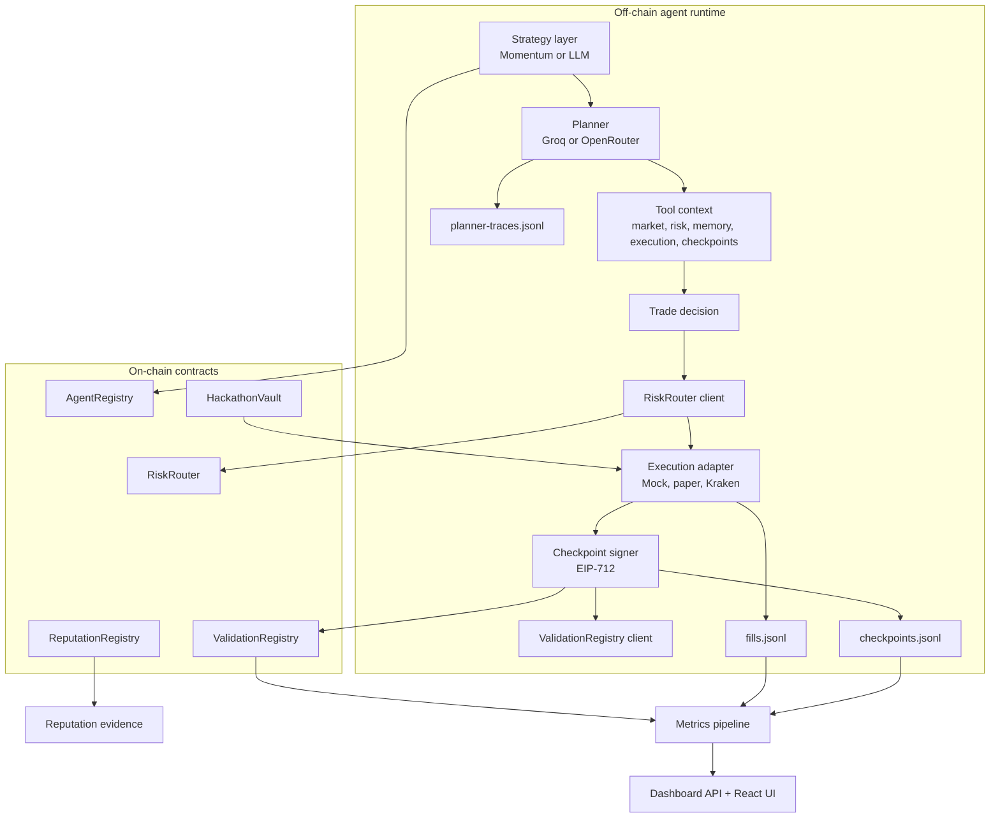

# Architecture Briefing

This document is a single reference for understanding the trading agent codebase end to end. It is written so another LLM can ingest it and answer questions about reliability, safety, performance, observability, and improvement opportunities without needing the full repo context.

## Executive Summary

The project is an autonomous trading system with four major layers:

1. An off-chain agent runtime that fetches market data, asks an LLM or fallback strategy for a trade decision, validates the decision against on-chain risk controls, executes paper or exchange orders, and writes signed checkpoints.
2. A small set of Solidity contracts that provide identity, capital allocation, risk enforcement, validation attestations, and reputation tracking.
3. A metrics and evidence pipeline that turns checkpoints and fills into score stories, manifests, and phase-readiness artifacts.
4. A dashboard stack that exposes the live status of the agent, traces, checkpoints, and metrics through an Express API and a React frontend.

The system is designed around traceability rather than hidden automation. Every important action leaves an artifact: planner traces, trade fills, signed checkpoints, validation attestations, deployment metadata, and submission evidence.

## High-Level System Map

## Repository Layout

| Area | Role |
|---|---|
| `contracts/` | Solidity contracts for identity, vault, risk routing, validation, and reputation. |
| `scripts/` | Operational entrypoints for deploy, register, run, dashboard, metrics, replay, evidence, and manifest generation. |
| `src/agent/` | Core agent orchestration, strategy selection, identity binding, and planner execution. |
| `src/exchange/` | Market data and order execution adapters for mock, paper, Kraken CLI, live Kraken, and Prism. |
| `src/llm/` | Prompt schema, provider selection, Groq/OpenRouter request wrappers, and response normalization. |
| `src/onchain/` | TypeScript client wrappers for each deployed contract. |
| `src/tools/` | Prompt tool context builders and renderers for market, risk, memory, execution, and checkpoints. |
| `src/explainability/` | Signed checkpoint generation and human-readable decision formatting. |
| `src/metrics/` | PnL, drawdown, validation, and score-story computation. |
| `src/types/` | Shared TypeScript interfaces for market data, decisions, signatures, fills, and checkpoints. |
| `ui/` | Vite + React operator console. |
| `test/` | Hardhat and TypeScript tests for planner schema, drawdown logic, and ERC-1271 compatibility. |
| `docs/` and `tutorial/` | Human-facing walkthroughs and setup notes. |

Generated or runtime artifacts live at the repo root and are part of the observable architecture:

- `deployed.json`
- `agent-id.json`
- `registration-proof.json`
- `checkpoints.jsonl`
- `fills.jsonl`
- `planner-traces.jsonl`
- `reputation-feedback.jsonl`
- `metrics.json`
- `submission-manifest.json`
- `phase2-evidence.json`

## Core Runtime Flow

The live agent loop is in `src/agent/index.ts`. The `run-agent` script adds a single-instance lock and then loads that module.

At a high level, every tick does this:

1. Fetch the current market snapshot from the selected adapter.
2. Ask the current strategy for a `TradeDecision`.
3. Render a human-readable explanation.
4. If the strategy is LLM-backed, append the planner trace to `planner-traces.jsonl`.
5. If the decision is actionable, preflight the on-chain risk router.
6. If the router approves, execute through the selected execution adapter.
7. Write the execution artifact to `fills.jsonl` or the paper broker journal.
8. Generate an EIP-712 checkpoint that ties together the decision, reasoning, market data, and intent hash.
9. Post the checkpoint hash to `ValidationRegistry` if available.
10. Append the checkpoint to `checkpoints.jsonl`.
11. Optionally submit reputation feedback if the loop is enabled.

This means the runtime is not just a trade bot. It is a trace-producing decision system.

## Agent Runtime Architecture

### Entry Points

- `scripts/run-agent.ts` acquires a process lock, then imports `src/agent/index.ts`.
- `scripts/dashboard.ts` starts the Express API and serves the embedded dashboard HTML.
- `scripts/preflight.ts` validates environment variables before deploy/register/run operations.

### Identity and Wallet Roles

The agent uses two wallet roles:

- `operatorWallet`: owns the ERC-721 identity token in `AgentRegistry`.
- `agentWallet`: signs TradeIntents and checkpoints.

These roles can be the same wallet for simplicity, but the code allows them to differ. The identity token ID is the `agentId` used across the system.

Identity handling lives in `src/agent/identity.ts`:

- It resolves `AGENT_ID` from the environment if present.
- Otherwise it resolves the agent by wallet, or registers a new agent on-chain.
- It writes `agent-id.json` once a new token is minted.

### Strategy Layer

The strategy abstraction is in `src/agent/strategy.ts` and is intentionally thin.

There are two default strategies:

- `MomentumStrategy`: deterministic, windowed momentum logic used for local testing and fallback behavior.
- `LLMStrategy`: delegates to the planner stack and returns the planner decision.

Strategy selection is controlled by environment:

- `TRADING_STRATEGY=llm` forces the planner path.
- `TRADING_STRATEGY=momentum` forces the deterministic fallback.
- Otherwise the code checks whether a planner provider is configured.

### Planner Stack

The planner pipeline lives in `src/agent/planner.ts` and `src/llm/schemas.ts`.

The planner is intentionally constrained:

- It must return strict JSON.
- It must produce one of `BUY`, `SELL`, or `HOLD`.
- It carries a `promptVersion` field, currently `2026-04-03-groq`.
- It may request a fixed set of tools: `market_snapshot`, `risk_snapshot`, `recent_memory`, `paper_preview`, and `checkpoint_summary`.

Planner execution works in two stages:

1. Build a system prompt and user prompt from the live market and on-disk context.
2. Parse and normalize the model response into a `PlannerResponse`, then critique it before allowing execution.

The planner prompt includes these context domains:

- market snapshot
- risk snapshot
- recent memory from checkpoints and fills
- paper execution preview
- checkpoint summary

The planner is guarded in several ways:

- Response parsing accepts wrapper-style and flat responses.
- Validation rejects unsupported fields.
- Critique blocks weak or inconsistent responses.
- Fallback behavior returns a HOLD decision rather than breaking the runtime.

### Tool Context Layer

`src/tools/` builds the planner context used by the LLM.

The tool layer is not execution logic. It is a prompt scaffold:

- `market.ts` summarizes bid, ask, spread, VWAP, range, and volatility hint.
- `risk.ts` summarizes mode, guardrails, and recent net notional.
- `memory.ts` summarizes recent checkpoints and fills.
- `execution.ts` renders a paper execution preview for the current decision.
- `checkpoints.ts` renders the checkpoint history summary.
- `index.ts` maps tool calls to those renderers and serializes the results back into the prompt.

This gives the model structured situational awareness without letting it mutate state directly.

### Market Data Adapters

The market layer is in `src/exchange/` and is selected by environment.

- `MockExchangeClient` generates deterministic synthetic ticks for local development.
- `LiveMarketClient` wraps the Kraken CLI client.
- `PrismMarketClient` queries Prism, caches responses locally, backs off on rate limits, and can fall back to Kraken public ticker data.
- `KrakenClient` wraps the Kraken CLI binary for both market data and private order flow.
- `KrakenMCPClient` is an alternative MCP-based integration path.
- `PaperExchangeClient` simulates fills and appends them to `fills.jsonl`.

Execution and market data are separate choices:

- `EXECUTION_MODE` controls order placement.
- `MARKET_DATA_MODE` controls price feed selection.
- Prism mode also uses a local cache and request budget so we do not hammer the Prism API.

This separation matters because the agent can run with live prices but paper execution.

### On-Chain Client Layer

The on-chain TypeScript clients live in `src/onchain/`.

- `vault.ts` reads and updates capital allocation in `HackathonVault`.
- `riskRouter.ts` builds and signs TradeIntents, preflights them, submits them, and reads risk state.
- `validationRegistry.ts` posts checkpoint attestations and reads validation scores.
- `reputationRegistry.ts` submits and reads reputation feedback.

These clients are thin wrappers around contract ABIs. They provide the TypeScript side of the off-chain/on-chain boundary.

### Explainability Layer

The explainability layer is in `src/explainability/`.

- `checkpoint.ts` generates a signed EIP-712 checkpoint and computes its digest.
- `reasoner.ts` formats the decision and checkpoint for console logs.

The key design choice is that reasoning is not just printed. It is hashed into the checkpoint so the explanation is cryptographically tied to the decision record.

## On-Chain Architecture

### AgentRegistry

`contracts/AgentRegistry.sol` is the identity layer.

It implements ERC-721-based agent identity:

- each agent is an NFT
- the token ID is the `agentId`
- the owner of the NFT is the operator wallet
- the agent wallet is the hot wallet used for signatures

Responsibilities:

- register an agent
- map `agentWallet` to `agentId`
- verify EIP-712 signed agent messages
- support wallet updates and deactivation

Why this matters:

- identity is transferable
- off-chain actions can be linked to an on-chain owner
- signature verification supports both EOAs and ERC-1271 wallets

### HackathonVault

`contracts/HackathonVault.sol` tracks capital allocations per agent.

Responsibilities:

- accept deposits
- allocate ETH to a specific agentId
- release capital
- prevent withdrawal of allocated funds

The vault is simple by design. It is the capital accounting layer, not a full treasury system.

### RiskRouter

`contracts/RiskRouter.sol` is the core safety gate.

It validates signed `TradeIntent` objects before execution.

Responsibilities:

- verify deadline
- verify nonce
- verify the agent wallet matches registry state
- verify the EIP-712 signature
- enforce risk rules
- record trades and update nonce on approval
- emit approval or rejection events

Risk parameters live in a per-agent struct:

- `maxPositionUsdScaled`
- `maxDrawdownBps`
- `maxTradesPerHour`
- `active`

The current template flow seeds the hourly cap from `scripts/register-agent.ts`, where `maxTradesPerHour` is initialized to 10.

The router also tracks trade records:

- `count`
- `windowStart`

This is how the per-hour cap is enforced.

The router owner matters:

- `setRiskParams(...)` is restricted to `onlyOwner`
- the constructor sets `owner = msg.sender`
- changing the cap on a deployed router requires the owner wallet or a redeployment

There is also a simulation path:

- `simulateIntent(...)` checks approval without state changes
- the TypeScript client uses a static call preflight before sending the state-changing transaction

### ValidationRegistry

`contracts/ValidationRegistry.sol` stores checkpoint attestations.

Responsibilities:

- post attestations for checkpoint hashes
- optionally restrict validators or allow open validation
- calculate average validation score per agent
- preserve a history of validation records

This contract is the scoring and attestation layer. It does not make the trade decision itself.

### ReputationRegistry

`contracts/ReputationRegistry.sol` stores feedback about the agent after interactions.

Responsibilities:

- accept feedback from counterparties or validators
- prevent self-rating by the operator, owner, or agent wallet
- enforce one rating per rater per agent
- maintain aggregate scores and history

This layer is separate from validation. Validation scores the checkpoint or proof quality. Reputation scores the subjective quality of the agent after interaction.

## Runtime Data Model

The TypeScript types in `src/types/index.ts` define the shared contract between the runtime, the metrics pipeline, and the UI.

Important types:

- `MarketData`: live market snapshot
- `TradeDecision`: output of the strategy or planner
- `TradeIntent`: EIP-712 intent sent to the router
- `SignedTradeIntent`: intent plus signature and hash
- `TradeCheckpoint`: signed explanation artifact
- `TradeFill`: execution record
- `AgentRegistration`: on-chain identity view

This schema boundary is important because the same concepts are reused across planner, execution, metrics, dashboard, and tests.

## Persistence and Artifact Flow

The system writes plain files instead of hiding state in memory. That is deliberate.

### Decision and Execution Artifacts

- `checkpoints.jsonl`: one signed checkpoint per tick
- `fills.jsonl`: one execution record per fill
- `planner-traces.jsonl`: one trace record for each LLM-backed planner turn
- `reputation-feedback.jsonl`: optional feedback loop records

### Deployment and Registration Artifacts

- `deployed.json`: deployed contract addresses and metadata
- `agent-id.json`: the resolved agent token ID and registration transaction hash
- `registration-proof.json`: typed-signature proof for the registered agent wallet

### Score and Readiness Artifacts

- `metrics.json`: score story summary from fills and checkpoints
- `submission-manifest.json`: required URLs and evidence pointers
- `phase2-evidence.json`: readiness and proof checks for submission-style workflows

The important design choice is that the runtime can be replayed and audited from these files alone.

## Metrics and Replay Architecture

The metrics pipeline lives in `src/metrics/index.ts`.

It builds a score story from checkpoints and fills:

- loads JSONL records
- normalizes checkpoints and fills
- computes realized and unrealized PnL
- computes max drawdown
- computes validation summary
- builds a recent action flow string
- emits a small leaderboard payload

Scripts built on top of that layer:

- `scripts/metrics.ts` writes `metrics.json`
- `scripts/replay.ts` prints a replay summary and recent planner traces
- `scripts/evaluate.ts` snapshots run metadata, applies one-shot hard gates, ranks matrix candidates, and selects a winner
- `scripts/report-equity.ts` posts current equity to `RiskRouter` and reads drawdown state

The metrics pipeline is intentionally file-based so it can operate on local runs and testnet runs the same way.

## Dashboard and Operator Console

### Express API

`scripts/dashboard.ts` runs the backend dashboard server on port 3000 by default.

It exposes these endpoints:

- `/api/status`
- `/api/checkpoints`
- `/api/price`
- `/api/traces`
- `/api/metrics`

Status inference is useful here: the dashboard can infer whether the agent is using momentum or LLM planning based on environment and planner traces.

### React Frontend

The `ui/` folder contains the operator console built with Vite and React.

The React app in `ui/src/App.tsx`:

- polls the backend every 4 seconds
- renders a hero summary with live price and a sparkline
- shows key metrics like PnL, drawdown, open position, and current model
- renders checkpoint and planner-trace feeds

Supporting components:

- `StatusChips` for runtime mode and provider info
- `MetricCard` for summary tiles
- `Sparkline` for the recent price history
- `CheckpointFeed` for signed checkpoints
- `TraceFeed` for planner turns

The console styling is intentionally distinct. It uses a dark, glassy design with gradients and monospace accents, so the operator can see live state quickly.

## Scripts and Operational Flows

### Deployment

`scripts/deploy.ts` deploys the on-chain contracts in this order:

1. `AgentRegistry`
2. `HackathonVault`
3. `RiskRouter`
4. `ReputationRegistry`
5. `ValidationRegistry`

It writes `deployed.json` and prints environment variables to copy into `.env`.

### Agent Registration

`scripts/register-agent.ts` registers the agent in `AgentRegistry`, generates the registration proof, and optionally seeds risk parameters on `RiskRouter`.

This is where the default risk profile is established for a fresh run.

### Capital Allocation

`scripts/allocate-sandbox-capital.ts` moves ETH from the vault into an agent allocation bucket.

### Runtime Launch

`scripts/run-agent.ts` acquires a lock and starts the agent loop.

`scripts/shared/single-instance.ts` prevents duplicate dashboard or agent instances from running at the same time by storing PID metadata in `.runtime-locks/`.

### Evidence and Submission

- `scripts/submission-manifest.ts` writes a manifest of required public links and evidence files.
- `scripts/phase2-evidence.ts` verifies that deployment, registration, manifest, drawdown, and reputation evidence are in place.

These scripts are not part of trade execution. They are the packaging and proof layer for external review.

## Environment and Configuration

The runtime is heavily environment-driven.

Important variables include:

- `SEPOLIA_RPC_URL`
- `CHAIN_ID`
- `PRIVATE_KEY`
- `AGENT_WALLET_PRIVATE_KEY`
- `AGENT_SIGNER_PRIVATE_KEY`
- `AGENT_REGISTRY_ADDRESS`
- `HACKATHON_VAULT_ADDRESS`
- `RISK_ROUTER_ADDRESS`
- `VALIDATION_REGISTRY_ADDRESS`
- `REPUTATION_REGISTRY_ADDRESS`
- `TRADING_STRATEGY`
- `LLM_PROVIDER`
- `GROQ_API_KEY`
- `OPENROUTER_API_KEY_A`
- `OPENROUTER_API_KEY_B`
- `EXECUTION_MODE`
- `MARKET_DATA_MODE`
- `KRAKEN_SANDBOX`

The configuration model is conservative:

- missing or placeholder values are blocked by preflight checks
- provider selection falls back from explicit provider to available credentials
- the planner can be disabled entirely by choosing the deterministic strategy

## Test and Verification Surface

The repo already contains focused tests that describe the intended invariants.

### Planner Tests

`test/llm-planner.ts` checks that the planner schema:

- accepts valid responses
- tolerates extra wrapper formats from Groq-style outputs
- normalizes terse responses
- builds the prompt context correctly

### RiskRouter Tests

`test/riskrouter-drawdown.ts` checks that drawdown breach handling rejects intents with a clear reason.

### Signature Compatibility Tests

`test/erc1271-signature-support.ts` checks that both EOA and ERC-1271 paths are supported for agent signatures and TradeIntent approval.

These tests are important because the system depends on typed signatures, on-chain verification, and schema normalization all working together.

## Important Design Invariants

These are the architectural rules the rest of the code assumes:

1. `agentId` is a `uint256` ERC-721 token ID, represented as `bigint` in TypeScript.
2. The agent wallet signs TradeIntents and checkpoints, but the operator wallet owns the identity token.
3. The RiskRouter is the execution gate. The strategy does not execute directly.
4. The planner must emit strict JSON and a valid prompt version.
5. Checkpoints must cryptographically bind reasoning to the action taken.
6. Fills and checkpoints are separate artifacts because one is execution and the other is intent and explanation.
7. The dashboard should never be treated as source of truth. It is a view over the recorded artifacts and chain state.
8. Risk parameters are owner-controlled on the deployed router.
9. If a contract is not owned by the operator, its mutable parameters cannot be changed without the owner or a redeployment.
10. The runtime should prefer holding or falling back over producing malformed planner output.

## Improvement Surfaces

If you want another LLM to review the codebase for improvements, these are the most useful seams:

### Risk and Safety

- drawdown enforcement can be expanded or tightened
- per-hour cap handling can be reviewed for race conditions or off-by-one boundaries
- capital allocation and position sizing can be connected more tightly
- failure handling around risk router preflight can be made more explicit

### Planner Quality

- prompt wording can be made more selective or more conservative
- tool-call usage can be reduced if it is not adding decision quality
- provider fallback behavior can be made more deterministic
- planner trace logging can be used to detect prompt drift

### Execution Reliability

- Kraken adapter error handling can be tightened
- paper and live execution paths can be unified more cleanly
- retry and cooldown policies can be made more explicit

### Observability

- dashboard status can include more direct contract-derived state
- metrics can expose more granular decision quality signals
- evidence files can be generated earlier in the pipeline

### Maintainability

- shared schemas could be further centralized
- generated contract bindings and manual ABIs could be reconciled
- runtime lock handling and process bootstrap could be simplified

## Suggested Questions To Ask Another LLM

Use this file as the context and ask questions like:

- Where are the biggest single points of failure in the runtime loop?
- Which parts of the planner path are most likely to drift from the intended schema?
- How could the risk router and capital allocation model be made safer without hurting throughput?
- What observability gaps would make debugging a bad trade easier?
- Which scripts are redundant and which ones should be merged?
- What pieces of state should move from flat files into a more structured store?
- Which contract-level invariants should be covered by more tests?

## Quick Mental Model

If you only remember one thing, remember this:

the agent is a planner-executor system where the LLM suggests a trade, the on-chain router decides whether it is allowed, the execution adapter places the order, the checkpoint layer records why it happened, and the metrics/dashboard stack turns that trail into something a human can inspect.
